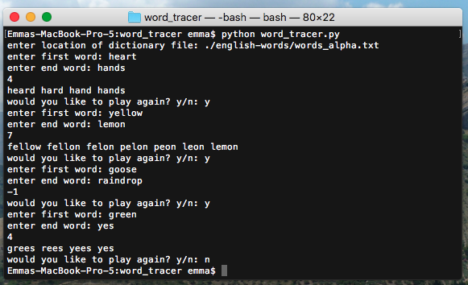

# Word-Tracer

## Summary
Enter two words and the program will switch and remove letters until the first word is equal to the second one. It will print out how many words it took to get from one to the other, or it will print "-1" if it's unable to find a line between the two.

You must also enter a dictionary path. I used [this one](https://github.com/dwyl/english-words).

## Screenshot

